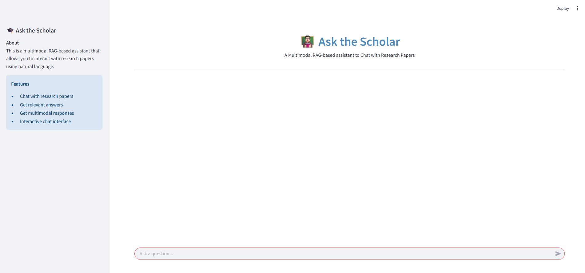

# Ask the Scholar: A Multimodal RAG-based Assistant to Chat with Research Papers

## Overview
A modular and scalable Retrieval-Augmented Generation (RAG) application powered by **Streamlit**, **LangChain**, **FastAPI**, **JinaCLIP**, and **Groq LLM**. This solution allows intelligent document ingestion, semantic search, and conversational synthesis, with enhanced support for structured prompts, multimodal responses, and persistent vector storage.

## 🚀 Features
### Core Features
- ✅ **Data Ingestion** - PDF Parsing + Chunking + Embedding + Storage
- ✅ **JinaCLIP** v2 embedding model from HuggingFace
- ✅ **ChromaDB** persistent vector store
- ✅ **Flexible Prompt Engine** using structured YAML configs
- ✅ **Groq API** integration for fast, accurate LLM inference
- ✅ **Conversation memory** for multi-turn chat sessions
- ✅ **Image/Table metadata** tracking for contextual linking
- ✅ **Extensible & Modular codebase** for RAG experimentation

## How It Works
### **Data Ingestion**:
1. Research papers are ingested into the vector store through the script **ingest.py**.

### **Retrieval & Synthesis**
1. User opens the Streamlit app and types a question to chat with the research papers.
2. The RAG-pipeline gets into action.
3. Relevant documnets are retrieved and a context-aware response is generated by an LLM using the GROQ API. 

## Tech Stack
- Streamlit
- FastAPI
- LangChain
- JinaCLIP
- GROQ API (LLM)

## User Interface


## 🔧 Setup Instructions
### 1. Clone the repo
```sh
git clone https://github.com/aminajavaid30/ask_the_scholar.git
cd ask_the_scholar
```

### 2. Install dependencies
```sh
pip install -r requirements.txt
```

### 3. **Add your API keys** - Create a .env file with:
```sh
GROQ_API_KEY=...
```

### 4. Initialize the backend
Navigate to the **backend** folder and run the following command:
```sh
uvicorn main:app --reload
```

### 5. Run the app
Navigate to the **frontend** folder and run the following command:
```sh
streamlit run Home.py
```

## Folder Structure
```sh
/code
    /backend
        /chroma_db  # Automatically created on first run
        /content    # Created on ingestion
        /images     # created on ingestion
        /logs       # created on ingestion & while running the app
        /tables     # created on ingestion     
        /config
            - config.yaml
            - prompt_config.yaml
        - ingest.py
        - logger.py
        - main.py (FastAPI App)
        - paths.py
        - prompt_builder.py
        - retrieve.py
        - synthesize.py
        - utils.py
    /frontend
        - Home.py
        - style.css
/data # Input PDFs
/outputs
.env
LICENSE
README.md
requirements.txt
```

## License
MIT License

## Acknowledgements
Built for **AAIDC2025** - #AgenticAIDeveloperCertification2025 - using Streamlit, LangChain, FastAPI, JinaCLIP, and GROQ API.